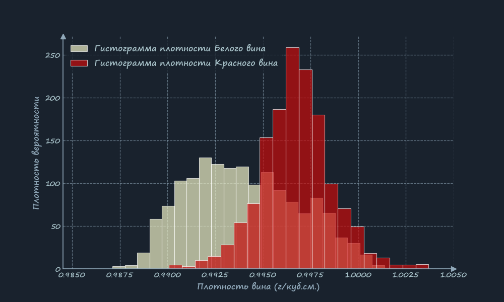
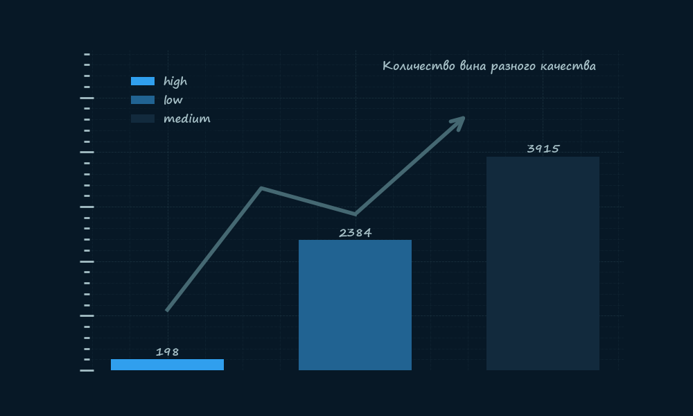
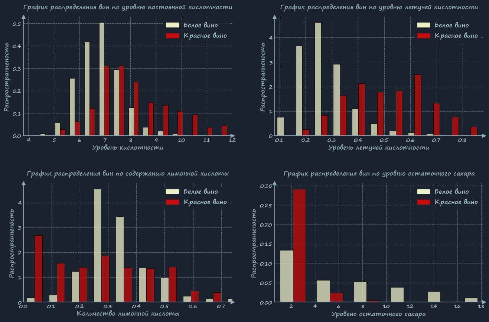

  

 

# Дизайн, основанный на науке о восприятии

Разработка фирменного стиля - сложная задача, требующая навыков
дизайнера и маркетолога, которыми я не являюсь. Тем не менее, я постарался
создать уникальный стиль, опираясь на принципы эффективности и психологии восприятия.
### 1. Мгновенное считывание показателей для ускорения принятия решений.
Исследования (проводила фирма LG для OLED телевизоров) доказали что темные цвета
излучают меньше света и снижают нагрузку на глаза. Тёмный фон работает как
сцена в театре: он "проваливается", а яркие элементы данныx выходят на передний план.
Мозг тратит меньше усилий на обработку фона и полностью концентрируется на информации.

### 2. Данные подаются как продукт премиум класса, что повышает доверие к ним.
В маркетинге темные тона прочно ассоциируются с роскошью и эксклюзивностью
### 3. Создание продукта для широкой аудитории
Высокий контраст это ключевое требование доступности (WCAG). Это делает графики понятными и читабельными
для людей с различными особенностями зрения.

### Исходный код: 
* **стиля визуализации:** [custom_dark_theme.py](custom_theme/custom_dark_theme.py) 
* **загрузки данных:** [config_test_data.py](data_visualization/config_test_data.py)
* **гистограммы плотности:** [wine_histogram.py](data_visualization/wine_histogram.py) 

 

# Применение стиля для задач анализа

### 1. Столбчатая диаграмма.
Данная диаграмма нужна для быстрого среза бизнеса. Все лишние детали такие как метки на осях убраны,
зрителю интересны лишь столбцы и цифры. Линия соединяющая вершины, хоть и не является "трендом", но
визуально связывает категории и делает статичную диаграмму более живой
### Исходный код: [bar_chart.py](data_visualization/bar_chart.py)

    

### 2. Анализ распределений в сетке.
Этот пример демонстрирует, как можно компактно разместить несколько графиков в одной сетке (subplots) для
быстрого сравнения распределений различных признаков. Такой подход идеален для исследовательского анализа данных (EDA),
когда нужно охватить взглядом несколько переменных.
### Исходный код: [grid_histogram.py](data_visualization/grid_histogram.py)
